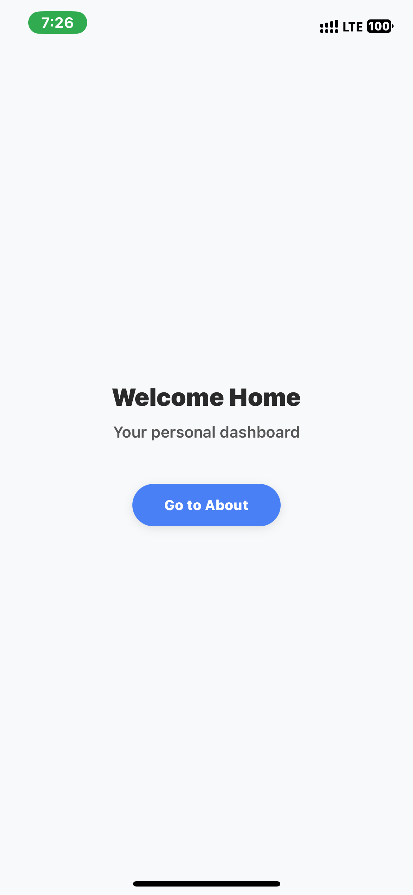
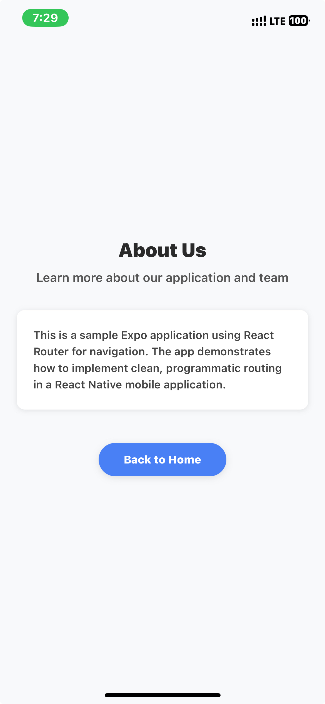

# Expo Project with React Router

## Project Overview
This project is a React Native mobile application built with Expo and React Router. Instead of using file-based routing (like Expo Router), this project implements programmatic routing with React Router Native, giving you more control over navigation flow and transitions.

## Key Features
- Built with Expo for cross-platform mobile development
- Implements React Router Native for navigation
- Simple screens with navigation links between them
- Ready for expansion with additional routes and components

## App Screenshots

### Home Screen


### About Screen


## Running the Project on Your Mobile Device

### Prerequisites
- Expo Go app installed on your mobile device
- Your development machine and mobile device connected to the same Wi-Fi network
- Yarn package manager installed globally on your development machine

### Steps to Run the App

1. Install Yarn globally (if not already installed):
   ```bash
   npm install -g yarn
   ```

2. Navigate to the project directory and install dependencies:
   ```bash
   cd testApp
   yarn
   ```

3. Start the development server:
   ```bash
   npm start
   ```

4. The terminal will display a QR code and development server information.

5. On your mobile device:
   - **iOS**: Open your camera app and point it at the QR code
   - **Android**: Open the Expo Go app and tap "Scan QR Code" within the app, then scan the code

6. The Expo Go app will automatically launch and load your project.

## Development Tips
- Any changes you make to the code will automatically reload in the Expo Go app
- You can add more routes by adding additional `<Route>` components to the Routes section
- Organize your screens into a separate directory for better code organization as the project grows
- Use React Router's navigation hooks for programmatic navigation when needed